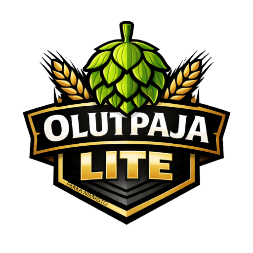

<h2>Hei! 👋</h2>

<!--
**olutpaja/olutpaja** is a ✨ _special_ ✨ repository because its `README.md` (this file) appears on your GitHub profile.

Here are some ideas to get you started:

- 🔭 I’m currently working on ...
- 🌱 I’m currently learning ...
- 👯 I’m looking to collaborate on ...
- 🤔 I’m looking for help with ...
- 💬 Ask me about ...
- 📫 How to reach me: ...
- 😄 Pronouns: ...
- ⚡ Fun fact: ...
-->
Olutpaja Lite on kevyt, selaimessa toimiva digitaalinen panopäiväkirja kotipanijoille. Se on suunniteltu erityisesti mobiilikäyttöön, jotta voit kirjata panopäivän tiedot ja seurata käymistä suoraan pannun tai käymisastian äärellä.

<h2>Ominaisuudet</h2>
<B>Erien hallinta:</B>
Tallenna useita eri keittoeriä ja palaa niihin myöhemmin. 
 
<B>Panopäivän seuranta:</B> Kirjaa ylös tavoitteet, mäskäyslämpötilat, huuhteluvedet ja humaloinnit. 
 
<B>Käymisseuranta:</B> 14 päivän seurantataulukko lämpötiloille ja ominaispainolle (SG). 
 
<B>Automaattiset laskurit:</B> Sovellus laskee alkoholipitoisuuden (ABV) automaattisesti syöttämiesi OG- ja FG-arvojen perusteella. 
 
<B>Tietojen turvaaminen:</B> Sisäänrakennettu JSON-vienti ja -tuonti varmuuskopiointia varten. 
 
<B>PWA-valmius:</B> Voidaan asentaa puhelimen kotinäytölle kuin tavallinen sovellus.

<H2>Tietosuoja</H2>
Olutpaja Lite tallentaa kaikki tiedot laitteesi paikalliseen muistiin (LocalStorage). Tiedot eivät siirry pilvipalveluihin, joten muista tehdä säännöllisesti varmuuskopioita Asetukset-sivun VIE JSON (VARMUUSKOPIO) -toiminnolla.
  
<b>Tekijä: Pekka Niemistö</b>

<i>Versio: 1.4</i>

<i><B>Lisenssi:</B> 
<b>Ei kaupalliseen toimintaan, yksityisen, yhdistyksen tai yrityksen toimesta!</b> Vapaaseen harrastekäyttöön. HTML-koodi on vapaassa käytössä ja sinulla on oikeus muokata ohjelmaa haluamallasi tavalla. Luo oma versiosi ja jaa se maailmalle! <b>Huom! Olutpaja Lite -logo ei ole vapaassa käytössä, kuvan oikeudet kuuluu Pekka Niemistölle (Pekan Olutpaja).</b>   </i>
